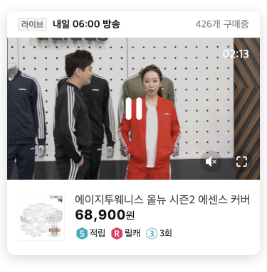

# Player

LIVE/VOD, OS, Web/App 모든 환경에서 일관된 동영상 Play Rule을 적용하여 탐색 구매동선상에서 Seamless한 경험을 제공합니다.

## Video Type

제공 data 형태에 따라 'LIVE'와 'VOD'로 구분

### LIVE

* 주조를 통해 실시간 스트리밍되는 생방송
* GS SHOP LIVE\(CATV\), GS MY SHOP\(데이터홈쇼핑\)으로 구분. \(모바일라이브는 제외\)
* Admin : SalesOne&gt;방송&gt;편성&gt;편성정보관리\(update 필요\)

### VOD

* Brightcove CMS Video ID를 기반으로 하여 제공되는 동영상
* Brightcove: [https://studio.brightcove.com](https://studio.brightcove.com/) \([kim.hk@gsshop.com](mailto:kim.hk@gsshop.com) / Cms12345678\)
* Admin : SalesOne&gt;MC/PC&gt;비디오매장관리&gt;VOD노출관리

## Player Type : In Player

페이지 이동없이 선택한 썸네일 영역안에서 재생되는 형태

### 인터렉션

* 영상 재생 전 재생버튼,시간정보 노출
* 재생중 스피커,전체보기 버튼 유지
* 재생중 영상영역 터치 시 모든 정보/기능 노출
* Auto Play : 서비스 영역에 따라 선택적으로 적용
* Mini Player : 스크롤시 형태 변형 플로팅, 재생 지점 연결 \(적용매장 : 상품페이지\)

### 영상 컨트롤

#### 스피커

* 재생중, 일시정지 상태에서 상시 노출
* 터치 시 음소거/소리재생 토글

#### 크게보기

* 재생중, 일시정지 상태에서 상시 노출
* Full Player로 실행시 재생 지점 연결
* 터치 시 가로영상은 Landscape 모드, 세로/정방형 영상은 Portrait 모드로 실행

#### 재생하기

* 재생 전 노출
* 재생중 일시정지 버튼 터치시 노출
* Auto Play 적용시, 시작 전 일시노출 후 재생 시작

#### 일시정지

* 재생중 영상영역 터치 시 노출

#### 다시보기

* 영상 재생이 완료된 후 노출

#### 상품보기

* 화면터치 시 노출
* 상품페이지 외 모든 영역에 적용

#### X 버튼

* LIVE 영역에 제공
* play 중단하고, Layer 닫기처리

#### Progress bar

* 제공안함

### 제공정보

#### 썸네일이미지 : VOD

* 재생 전, 재생완료 시 노출
* 영상 화면 스크린샷\(Brightcove 자동생성\) or 스크린샷 편집 이미지

#### 썸네일이미지 : LIVE

* 재생 전, 재생완료 시 노출
* 상품이미지 \(640x320\)

#### 영상시간 : VOD

* 재생 전, 영상영역 터치 시 노출
* 총 영상시간 mm:ss 형태로 카운트 다운
* 우측상단 표기

#### 영상시간 : LIVE

* 재생 전, 영상영역 터치 시 노출
* 남은 시간 hh:mm:ss 형태로 카운트 다운
* 플레이버튼 하단 중앙 표기

#### 영상구분자 : VOD

* 재생 전 노출
* 체험/시연, 언박싱, 인터뷰, 스타일링팁 4가지 제공

#### 과금안내

* dimed 40% 영상영역에 표기

### State

#### Play

#### Pause

#### Replay

#### Info

## Player Type : Full Player

페이지 이동없이 선택한 썸네일 영역안에서 재생되는 형태

### 인터렉션

* 영상 재생 전 재생버튼,시간정보 노출
* 재생중 스피커,전체보기 버튼 유지
* 재생중 영상영역 터치 시 모든 정보/기능 노출
* Auto Play : 서비스 영역에 따라 선택적으로 적용
* Mini Player : 스크롤시 형태 변형 플로팅, 재생 지점 연결 \(적용매장 : 상품페이지\)

### 영상 컨트롤

#### 스피커

* 재생중, 일시정지 상태에서 상시 노출
* 터치 시 음소거/소리재생 토글

#### 크게보기

* 재생중, 일시정지 상태에서 상시 노출
* Full Player로 실행시 재생 지점 연결
* 터치 시 가로영상은 Landscape 모드, 세로/정방형 영상은 Portrait 모드로 실행

#### 재생하기

* 재생 전 노출
* 재생중 일시정지 버튼 터치시 노출
* Auto Play 적용시, 시작 전 일시노출 후 재생 시작

#### 일시정지

* 재생중 영상영역 터치 시 노출

#### 다시보기

* 영상 재생이 완료된 후 노출

#### 상품보기

* 화면터치 시 노출
* 상품페이지 외 모든 영역에 적용
* 편성표 정보에 매핑된 주상품코드 기준으로 대표이미지 섬네일\(V1\) 제공
  * 멀티상품 방송\(주상품코드가 여러개\)인 경우, 상품별 편성시간 체크

#### X 버튼

* play 중단하고, Layer 닫기처리

#### Progress bar

* drag and drop으로 구간이동 가능한 Slider 기능적용. 액션 시, 별도 정보 제공은 안함
* LIVE 영상은 제공 안함

### 제공정보

#### 썸네일이미지 : VOD

* 재생 전, 재생완료 시 노출
* 영상 화면 스크린샷\(Brightcove 자동생성\) or 스크린샷 편집 이미지

#### 썸네일이미지 : LIVE

* 재생 전, 재생완료 시 노출
* 상품이미지 \(640x320\)

#### 영상시간 : VOD

* 재생 전, 영상영역 터치 시 노출
* 총 영상시간 mm:ss 형태로 카운트 다운
* 우측상단 표기

#### 영상시간 : LIVE

* 재생 전, 영상영역 터치 시 노출
* 남은 시간 hh:mm:ss 형태로 카운트 다운
* 플레이버튼 하단 중앙 표기

#### 과금안내

* dimed 40% 영상영역에 표기

### Player Mode

In Player에서 크게보기 버튼 터치 시 가로영상은 Landscape 모드, 세로/정방형 영상은 Portrait 모드로 실행합니다.

#### Landscape

#### Portrait

