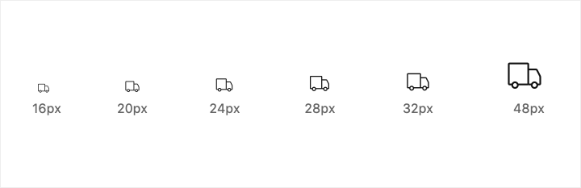

# Iconography

GS SHOP 아이콘은 사용자 인터페이스의 명령, 중요한 개념과 오브젝트를 상징적으로 단순하게 시각화하여 사용성을 높인다. 주요 액션과 내비게이션, 상태 정보, 토글 등에 사용한. 아래의 아이콘은 추후 최적화를 통해 모바일과 데스크탑에 동일하게 적용 된다.

## Icon 기본 규칙

아이콘의 디자인은 일러스트레이터에서 벡터로 디자인한 후 스케치파일에서 심볼화하여 관리한다.

아이콘은 SVG 버전을 기본으로 적용한다. 라이브러리화 된 GSSHOP-ICON Sketch Library 파일로 공유해서 동일한 아이콘을 적용한다. 아이콘이 추가되는 경우 GSSHOP-ICON-Library 에 업데이트하여 공유한다.

개발에 넘겨지는 아이콘은 [https://icomoon.io](https://icomoon.io/)에서 SVG화하거나 폰트화해서 개발에 적용한다.\(개발자와 협의 필요, 웹의 경우 SVG로 iOS와 Android는 어떻게 통일시킬지는 협의필요\)

## Icon 네이밍 및 그룹 

* 아이콘은 \[ 주내용\_보조내용 \] 으로 작성한다. 예\) arrow\_back
* arrow-back 같이 \[-\]는 사용하지 않는다.
* 아이콘 이름은 **디자인 작업과 코딩 작업 모두 동일하게 사용**하는 것을 권장.
* 아이콘 이름과 그룹명은 [머터리얼 디자인 아이콘 페이지](https://material.io/icons/) 참고.
* 이름의 묶음은 **최대 3개**로 하며, 아이콘 set 내에서 그룹이 가능하지 않거나 가독성을 크게 방해하지 않는다면 2개로 설정한다.예\) icon\_save\_for\_later \(X, 4개 묶음\) / arrow\_drop\_down \(O, 2~3개 묶음\) 예\) zoom\_in\(O, 2개\) / yellow\_id \(O, 2개\)
* 그룹은 크게 Action , Navigation , AV, Status , Toggle , Social 로 나눈다\(추후 추가 될수 있음\)
* 아이콘 네이밍 및 그루핑 참고 사이트 [Icons - Material Design](https://material.io/tools/icons/?icon=notifications_active&style=outline) ,  [IBM Icon Library](https://www.ibm.com/design/language/elements/icon-library)[Material Design](https://material.io/tools/icons/?icon=account_circle&style=outline)

## **Base Grid** 

시스템 아이콘은 28 x 28px를 기본으로 디자인 한다. \(리 디자인 시 32px 로 크기 조정 고려중\)**.** 픽셀 퍼펙트 pixel-perfect 를 위해 100 % 눈금으로 볼 수있는 기본 그리드를 사용하여 아이콘을 디자인한다. 최적의 형태와 세부 묘사를 위해 디자인시 미세 조정을 할 수 있다.

## **Padding** 

그리드에는 2px 패딩이 포함된다. 이렇게하면 SVG나 PNG로 저장할때 전체 아이콘 세트의  아이콘들이 일정한  크기와 패딩을 유지하게된다. ****패딩을 제외한 24px가 실제 아이콘이 그려지는 영역이다. 이 패딩 영역은 아이콘 세트의 시각적인 무게를 위한 경우가 아니라면 패딩 영역을 넘어서면 안된다. 

## Color 

아이콘은 UI에서 밝은색 백그라운드와 어두운 색 백그라운드에서 사용될 수 있다. 아이콘에 기본으로 사용하는 컬러는 백그라운드에 따라 아래에서 제시하는 3가지 색을 사용한다. 아래 제시된 컬러를 제외하고 액션에 사용될 경우 액션에 사용하는 컬러를 사용할 수 있다.

### Icons on light backgrounds 

배경색이 흰색 일 경우 아이콘의 컬러는 아래 규정을 기본적으로 따른다.

* SVG 활용을 위해 기본 Black 컬러 \( \#111111 \) 로 작업하여 Export 하는 것을 권장.
* Sketch 작업시에는 Symbol을 이용하여 컬러 적용.

#### **Active icon** 

흰색 같은 밝은색 백그라운드에 사용되는 활성화 상태에서 눈에 띄어야 하는 아이콘의 기본 색은 gray 900 \(\#111111\) 이다. 일반 활성화 상태는 gray 700\(\#666666\)을 사용한다.

#### **Inactive icon** 

낮은 시각적인 계층에 사용될 경우는 gray 500\(\#999999\)를 사용한다.

#### **Disabled icon** 

비활성 상태일 경우 아이콘의 컬러는 gray 400\(\#D9D9D9\)를 사용한다.

###  

### Icons on dark backgrounds 

어두운 색\(Dark 모드\)이 배경색 일 경우 아래와 같은 컬러를 기본으로 적용한다.

#### **Active icon** 

어두운색 백그라운드의 활성화 상태에서 눈에 띄어야 하는 아이콘의 기본 색은 white \(\#FFFFFF\) 이다. 일반 활성화 상태는 gray 400\(\#D9D9D9\)을 사용한다.

#### **Inactive icon** 

낮은 시각적인 계층에 사용될 경우는 gray 600\(\#8888888\)를 사용한다.  

#### **Disabled icon** 

비 활성 상태일 경우 아이콘의 컬러는 gray 800\(\#444444\)를 사용한다.

## Icon Size 

아이콘은 16px, 20px, 24px,28px, 32px, 48px 의 6 가지 크기에서 가장 잘 작동하도록 디자인되었다.

* 기본 28px \* 28px
* 일러스트레이터에서 Stroke를 활용한 경우 Export시 수정을 위해 원본 아이콘을 백업한 다음 Outline Stroke 처리를 한다.
* 파일 용량을 고려하여 스케치에서 벡터 요소를 전부 합쳐서 사용
* 적용 사이즈 16px , 20px , 24px, 28px, 32px, 48px

## Space 

가독성과 정확한 손가락 터치를 위해서 아이콘을 포함해 적절한 공간을 필요로 합니다. 28px의 아이콘은 48dp의 터치 대상을 사용할 수 있다.\(추후 사이즈 조정 될 수 있다.\)

### 좁은 영역의 아이콘 적용 

좁은 영역의 레이아웃일 경우 아이콘과 공간의 크기를 조절할 수 있다. 이때의 수치는 20px아이콘에 40px의 터치 영역을 가진다.

## **Icon Library** 

페이지 및 기능에 따라 그룹으로 나누어 제공된다. 그룹명은 주요 사용에 의해 정의**.**

### Action

### Content

### AV

### **Navigation** 

### **Image**

### **Status** 

### **Toggle**

### **Social** 

### **Social Logo**

## Sketch Library Symbols 

아래 GS SHOP Icon Libray 를 통해 디자인에 적용하고 라이브러리는 지속적인 관리와 업데이트 예정



