# UI Component Naming

Web ,iOS 와 안드로이드 플랫폼 간에 동일한 기능을 하는 UI Component의 명칭이 동일하지 않다.

예를 들어 화면 상단의 뒤로가기 버튼이 있는 Bar의 이름을 Web에서는 "Header" 라고 하고 iOS에서는 "Navigation Bar", 안드로이드에서는 "App Bar" 라고 한다. 이런 명칭의 불일치는 커뮤니케이션의 혼란을 부른다.

일관된 명칭을 사용하면 UI Components에 대한 커뮤니케이션 훨씬 쉬워진다. 디자이너,개발자,PO 등 내부 인원 간에 모든 플랫폼에서 효율적이고 일관성 있게 의사 소통을 위해 주요 Component 명칭을 통일해야 한다.

\(위 명칭은 초안으로 추후 논의 후 최종 확정할 예정임\)

## Navi Bar

Status bar 아래의 앱 화면 상단에 나타나며 계층적 화면을 탐색 할 수 있다. 앱의 상단의 타이틀과 아이콘이 있는 바의 이름은 iOS에서는 “Navigation Bar” 안드로이드에서는 “App Bars : top” 라고 한다. GS SHOP에서는 "Navi Bar" 라는 명칭을 사용한다.

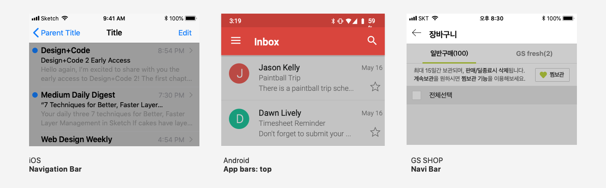

## Tab Bar

앱의 하단에 아이콘과 레이블로 구성된 네비게이션 기능을 가진 바의 명칭을 iOS에서는 “Tab Bar” 안드로이드에서는 “Bottom Navigation”이라고 한다. GS SHOP는 “Tab Bar” 라는 명칭을 사용한다.

## List

특정 정보의 항목들이 쌓이는 구조를 iOS는 “TableViewCell” 안드로이드는 “List”라고 한다. GS SHOP에서는 “List”로 사용한다. 개별 리스트는 List Low 라고 부른다.

## Action Sheet

Action Sheet 또는 Sheet는 모바일에서 주로 사용한다. 대화상자나 경고 Alert 대신 사용하기도 한다. 주로 사용하는 용도는 두 가지 이상의 항목 선택에 사용하거나 두 가지 이상의 액션을 제공할 때 사용한다. 큰 화면에서는 iOS는 Pop over , 안드로이드는 Dropdown Menu로 보여진다. 명칭은 iOS는 “Action Sheet” 안드로이드는 “Modal bottom sheet”로 부른다. GS SHOP은 “Action Sheet”로 사용한다.

## Progress indicator

사용자가 앱이 콘텐츠를 로드하거나 긴 데이터 처리 작업을 수행할 경우 진행률 표시 줄을 사용하여 앱에서 작업의 진행 상황과 대기 시간을 알 수 있게 한다. iOS와 안드로이드 모두 “Progress indicator”라고 한다. 바 형태와 원형 형태의 명칭은 각각 다르다.

### Progress Bar

바 형태의 Progress indicator는 iOS는 “Progress Bars” 안드로이드는 “Linear progress indicators”로 부른다. GS SHOP은 현재 바 형태의 Progress indicator가 없지만 “Progress Bar” 로 사용한다. 주로 Navi Bar 나 Tool Bar에 사용된다.

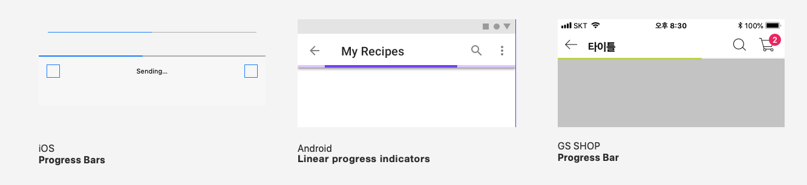

### Spinner

“Spinner” 또는 “Circular progress indicators”는 원형 Progress indicator 다. 주로 작은 공간에 사용한다. iOS는 작업이 완료되는 시간이 명확하지 않을때 \(Indeterminate\) 사용한다. GS SHOP은 “Spinner”를 사용한다.

## Tab

앱의 화면 상단에 동일하고 연관성 있는 계층 구조의 정보 분류를 나타내고 이동하는데 사용한다. iOS에서는 “Segmented controls” , 안드로이드는 “Tab”라고 부른다. GS SHOP은 “Tab”명칭을 사용한다.

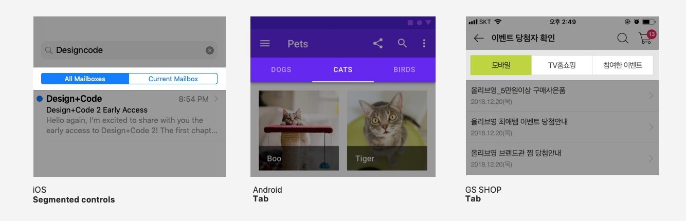

## Switch

스위치는 모바일 및 태블릿에서 단일 옵션을 켜거나 끈다.Togle Switch라고도 부르며 iOS와 안드로이드 모두 “Switch” 로 부른다. GS SHOP도 “Switch”라고 한다.

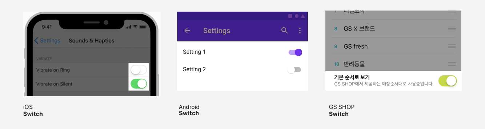

## Alert dialog

경고 대화 상자는 긴급하거나 오류의 가능성 등 중요한 정보를 모달 상태로 제공된다. Dialog 의 한 형태이다. Alert dialog 를 사용한다.

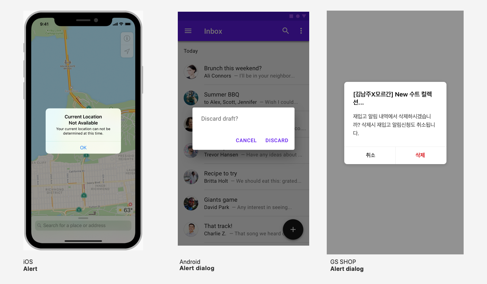

## Full-screen dialog

메시지 작성, 상품평 등록, 사진 편집과 같은 복잡한 작업을 사용한다. Modal 상태로 전체화면을 덮는다. 따라서 뒤로가기 버튼 등 이전 커텍스트 화면은 Full-screen modal에 덮여보이지 않는다. 우측에 닫기\(Cancel\)버튼 또는 X 아이콘 버튼으로 모달 상태를 빠져 나온다. iOS는 “Full-screen modal view “ 안드로이드는 “Full-screen dialog” 로 부른다. GS SHOP도 “Full-screen dialog”라고 한다.

## Search Bar

필드에 검색어 텍스트를 입력하여 검색 할 수 있다. iOS와 안드로이드 모두 “Search Bar” 로 부른다. GS SHOP도 “Switch”라고 한다.

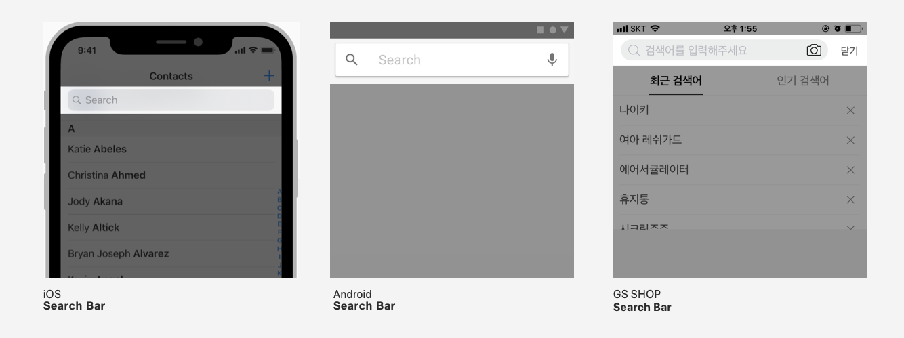

## Card

Card는 하나의 주제에 관한 콘텐츠와 액션을 포함한다. iOS와 안드로이드 모두 “Card” 로 부른다. GS SHOP도 “Card”라고 한다.

## Divider

Divider는 List 및 레이아웃의 콘텐츠를 그룹화하는 가는 선이다. 웹에서는 “Border Bottom” 이라고 하고 iOS에서는 “Separator” , 안드로이드는 “Divider”라고 부른다. GS SHOP은 “Divider”명칭을 사용한다.

## Dropdown Menu

Dropdown Menu 또는 Popover는 컨트롤을 탭할 때 화면 위에 나타나는 일시적인 요소이다. 드롭 다운 메뉴에는 아이콘, 버튼 또는 액션의 리스트가 표시된다. iOS에서는 “Popover” , 안드로이드는 “Dropdown Menu”라고 부른다. iOS는 “Popover”를 아이폰에서 사용하지 말고 대신 “Action Sheet” 사용을 권장한다. GS SHOP은 “Dropdown Menu”명칭을 사용한다.

## Slider

슬라이더는 사용자가 손가락으로 슬라이드하여 미디어 재생 중에 화면 밝기 레벨이나 위치와 같이 최소값과 최대값 사이의 범위를 선택할 수 있다. iOS와 안드로이드 모두 “Slider” 로 부른다. GS SHOP도 “Slider”라고 한다.

## Carousel

캐러셀은 좌우 스크롤하여 콘텐츠를 확인할 수 있는 UI 패턴이다. 회전 목마와 같이 이미지 또는 카드를 순환하여 볼수 있다. 플랫폼 별 특정 콤포넌트를 다루진 않지만, “Carousel” 로 통칭된다.

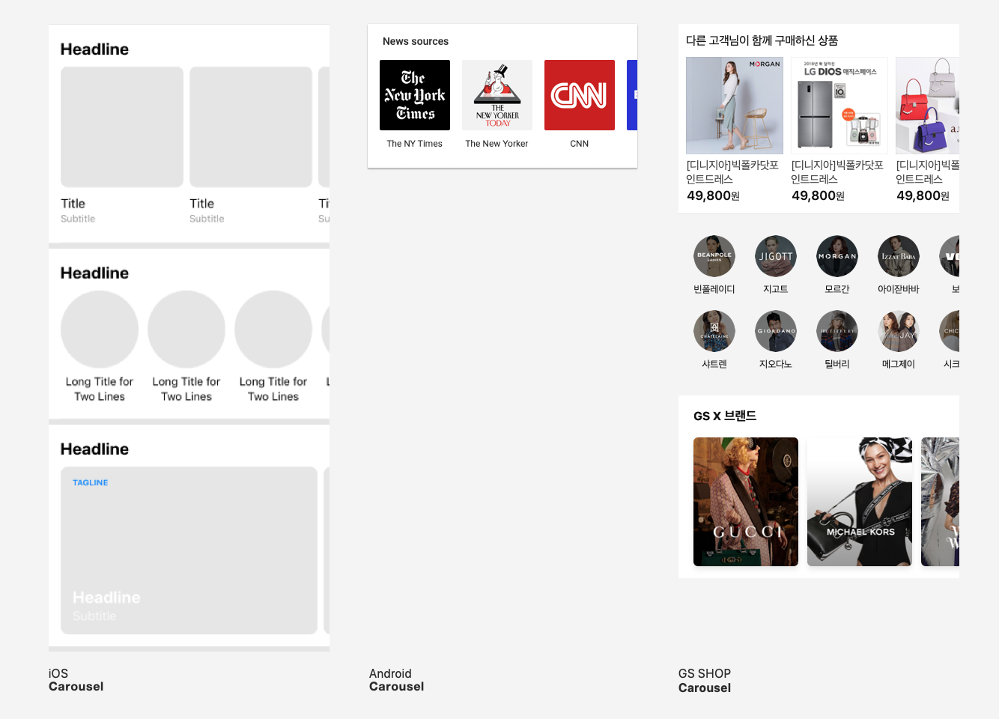

## Pickers

Picker는 하나 이상의 스크롤 가능한 개별 값 목록이 모달 형태로 나타난다. 사용자는 각 목록 중 하나를 선택하여 필드입력이나 메뉴 선택을 할 수 있다. 모바일에서는 화면의 하단에 모달 형태로 나타난다.\(안드로이드의 Sheet와 동일 위치\) 날짜나 시간 선택\(Date Picker, Time Picker\) , 컬러선택 \(Color Picker\) 등이 있다.

### Date Picker

날짜 선택 도구는 특정 날짜, 시간 또는 둘 다 를 선택하기 위한 콘트롤이다. iOS는 “Date Picker” 로 안드로이드도 “Date picker”로 부른다. GS SHOP도 “Date Picker” 로 사용한다.

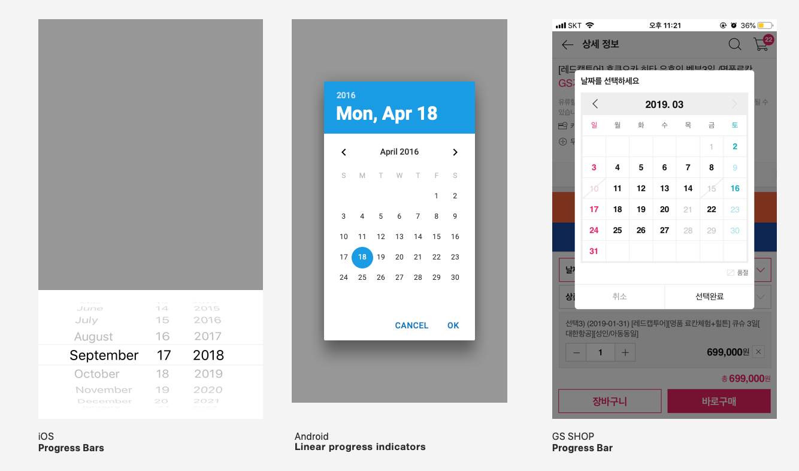

## Toolbar

툴바는 앱 화면 하단에 표시되며 현재 화면의 콘텐츠와 관련된 액션을 수행하기 위한 아이콘 버튼, 또는 텍스트 버튼을 포함한다. iOS에서는 “Toolbar” 안드로이드에서는 “Bottom Tool Bar”이라고 한다. GS SHOP는 “Tool Bar” 라는 명칭을 사용한다.

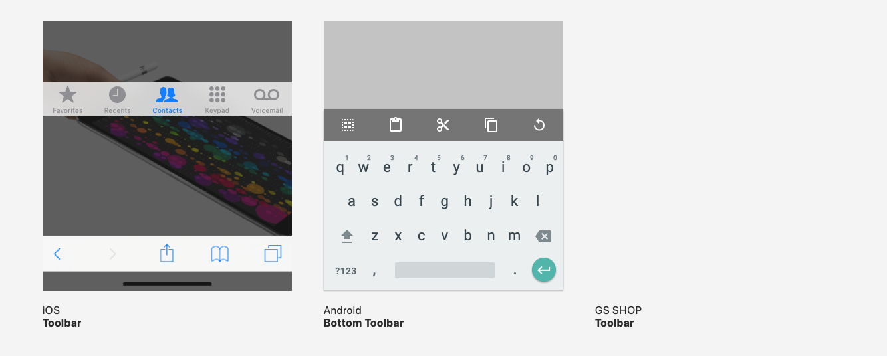

## Avatars

아바타는 기본적으로 원형\(라운드 사각형\)으로 사용자, 브랜드 등을 쉽게 식별가능하게 할때 사용한다. “Avatar” 라는 명칭은 다양한 디자인시스템에서 사용하고 있어 GS SHOP는 “Avatar” 라는 명칭을 사용한다.

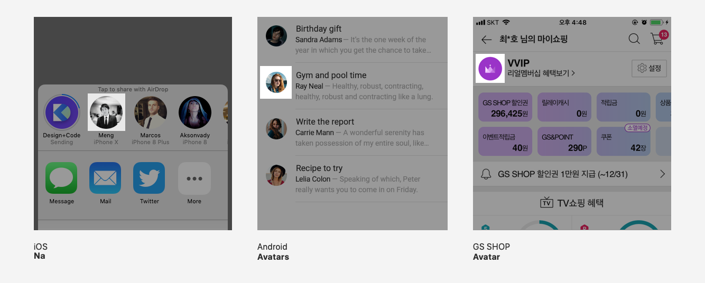

## Pagination Dots

페이지간 이동 할 수 있는 컨트롤을 “Pagination”이라고 한다. iOS는 도트 형태의 페이지 이동 인디케이터를 “Pagination Dots”라고 부른다. GS SHOP는 “Pagination Dots” 라는 명칭을 사용한다.

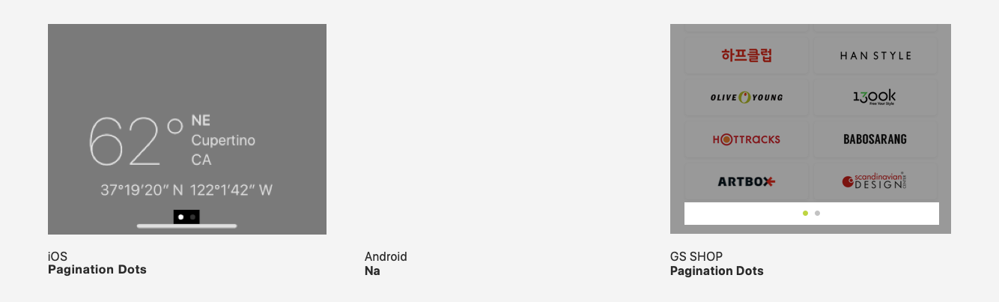

